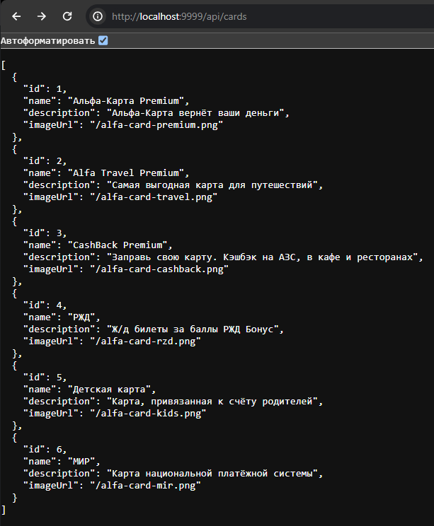

# Домашнее задание к занятию «3.1. Docker»

## Задача №2: докеризация приложения (необязательная)

Приложение можно упаковать в Docker-образ, чтобы затем запускать из него контейнеры.

Сделать это, в принципе, несложно: достаточно создать файл `Dockerfile`, в котором описать правила сборки образа.

Для лучшего пониманию процесса докеризации приведем небольшой пример с использованием учебного приложения для Node.js.

**Важно:** Для решения домашнего задания надо будет выполнить докеризацию другого учебного приложения.

Поскольку наше приложение для Node.js написано на языке JavaScript, то со слов разработчиков:

```
Компилировать ничего не надо.
Нужна только установленная Node.js версии не ниже 12.
В командной строке нужно выполнить: npm install для установки зависимостей.
Для запуска приложения нужно выполнить: npm start.
Приложение запустится на порту 9999.
```

Итак, начнём по порядку. Мы, конечно, можем с нуля собрать образ, но так почти никто не делает. Мы можем взять уже
готовый образ, в котором установлена платформа Node.js.

Поскольку мы рассматриваем простейший сценарий, то сборка образа сведётся к следующим инструкциям:

* `FROM` — выбираем готовый образ для старта, на базе которого мы будем создавать свой;
* `WORKDIR` — установим рабочий каталог внутри образа;
* `COPY` — копируем файлы из текущего каталога в файловую систему образа;
* `RUN` — выполняем дополнительные действия, например, установку зависимостей;
* `CMD` — описываем команду запуска;
* `EXPOSE` — описываем, какие порты будет слушать контейнер.

[Полное описание синтаксиса Dockerfile](https://docs.docker.com/engine/reference/builder/).

Идём на Docker Hub и ищем Node.js:


Начинаем писать наш `Dockerfile`:

```
FROM node:erbium-alpine3.12
```

[Apline Linux](https://wiki.alpinelinux.org/wiki/Docker) — минималистичный образ, который часто используется в качества
базового благодаря своим небольшим размерам — около 5 мегабайт.

Устанавливаем рабочий каталог и пишем команду копирования всех файлов из текущего каталога нашего проекта в образ:

```
FROM node:erbium-alpine3.12
WORKDIR /opt/app
COPY . .
```

Запускаем команду установки зависимостей из инструкции разработчиков:

```
FROM node:erbium-alpine3.12
WORKDIR /opt/app
COPY . .
RUN npm install
```

Примечание: здесь есть нюансы, связанные с послойной организацией файловой системы образов Docker, но мы для простоты
изложения проигнорируем их.

Прописываем команду старта:

```
FROM node:erbium-alpine3.12
WORKDIR /opt/app
COPY . .
RUN npm install
CMD ["npm", "start"]
```

Да, CMD пишется достаточно странно, но это связано с особенностями обработки. Текущая форма называется `exec form` и
представляет из себя JSON-массив в формате: `["executable","param1","param2"]`. О деталях вы можете
почитать [на странице описания Dockerfile](https://docs.docker.com/engine/reference/builder/#cmd).

Последнее, что осталось, — указать нужные порты. Это просто информация для того, кто будет запускать контейнер:

```
FROM node:erbium-alpine3.12
WORKDIR /opt/app
COPY . .
RUN npm install
CMD ["npm", "start"]
EXPOSE 9999
```

Собираем командой:
`docker image build -t node-app:1.0 .`, где `-t` — это задание тега образу.

Если всё соберётся успешно, то вы можете стандартными средствами посмотреть, что теперь ваш образ есть на вашем
компьютере:
`docker image ls`.

А также запустить из него контейнер, в том числе с использованием Docker compose.

Можно собрать всё приложение и запустить, сразу используя следующую конфигурацию Docker compose:

```yml
version: '3.7'
services:
  node-app:
    build: .
    image: node-app:1.0
    ports:
      - '9999:9999'
```

`build: .` означает, что мы собираем образ из `Dockerfile`, находящемся в текущем каталоге.

И запускайте `docker-compose up --build`. Уберите флаг `--build`, чтобы образ не пересобирался каждый раз.

Готовый проект вы можете найти в каталоге `node` вместе с файлом `docker-compose.yml`.

**Важно:** После изучения примера, можно перейти к выполнению домашнего задания.

Теперь ваша задача — взять готовое приложение для контейнеризации `db-api-for-docker.jar` (оно без зависимостей, никакая
СУБД ему не нужна) и упаковать в образ, то есть создать `Dockerfile` и `docker-compose.yml`.

Общие условия:

* приложению для работы нужна Java 8, используйте в качестве базового образа openjdk:8-slim;
* никаких внешних файлов, кроме самого JAR-ника не требуется;
* JAR-ник запускается командой `java -jar db-api-for-docker.jar` и поднимает сервер на порту 9999. Для теста
  сделайте `GET http://localhost:9999/api/cards`.

В результате выполнения этой задачи вы должны положить в репозиторий следующие файлы:

* .gitignore
* db-api-for-docker.jar,
* Dockerfile,
* docker-compose.yml,
* README.md со скриншотом ответа приложения.
